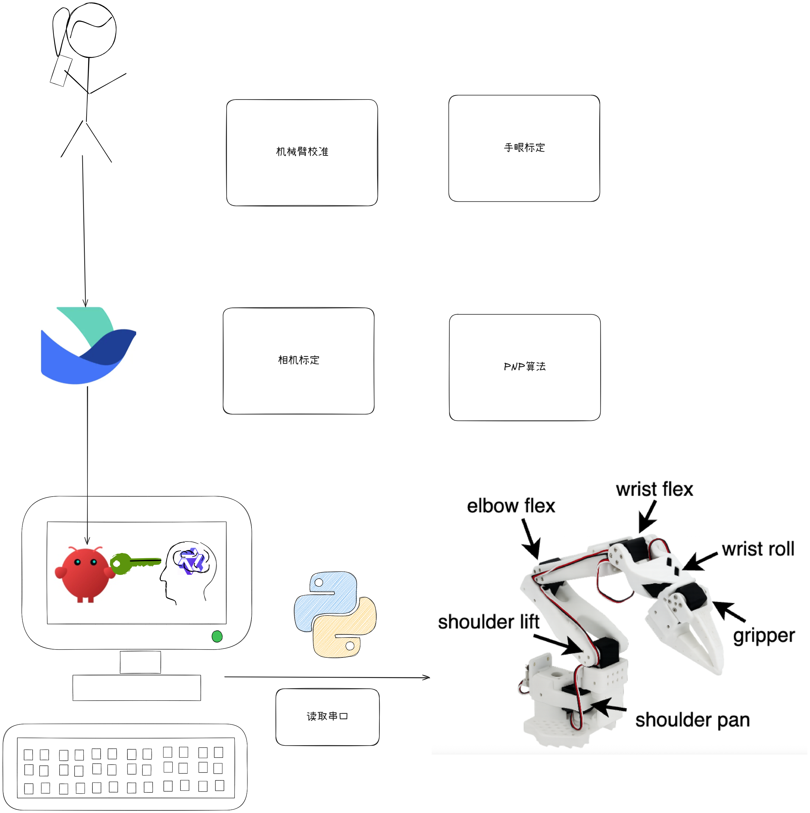
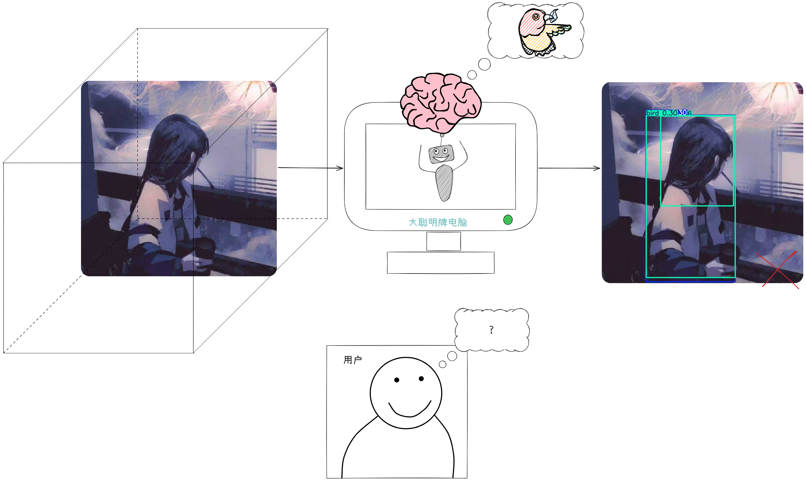

# 项目效果演示

 [观看演示视频](./movie.mp4)
 
# 项目说明
 
使用openclaw/claude code控制机械臂的全流程，参考机器人三大法则设定的skill。
# 快速开始

```bash
git clone https://github.com/xxx/claw_arm.git
cd claw_arm
pip install -r requirement.txt
claude  # 或 openclaw
```

将 skills/nature_arm 粘贴到对应的skills文件夹下
输入：`/nature_arm 跳个舞`


# 实现流程

1.找到SDK
2.编写技能脚本
3.让openclaw识别到技能
4.调用技能
5.配置飞书
6.自然聊天

# 方案
1.传统几何方案（nature_arm）


2.具身智能方案（未来将基于lerobot实现）

# 项目目录

- docs/      存放开发文档和规范
- skills/    存放skills（claude code和openclaw）
- script/    存放调试脚本
- SDK/       存放电机的SDK
- CV/        存放与视觉相关的代码
- Joints/    存放与关节控制的代码
- SO100_Description/  存放与机械臂相关的描述文件

# 注意事项

- 神奇的openclaw的skills和常见的skills规格不太一样
