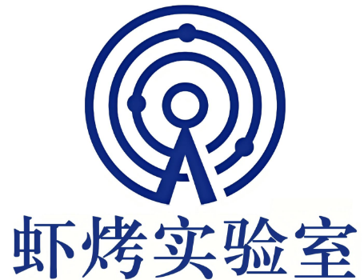

<div align="center">

  

  # Claw Arm

  ### **让机械臂听懂你的话**

  <i>看到 - 理解 - 行动</i>

  <p>

  <a href="./movie.mp4">
    
  </a>
  <a href="docs/01-getting-started.md">
    
  </a>
  <a href="README.md">
    
  </a>

</div>

---

## 这是什么？

**Claw Arm** 是一个让机械臂"变聪明"的开源项目。

```
你说："抓起那个红色的方块"
它做：识别方块 -> 计算位置 -> 精准抓取 -> 完成
```

**不需要**机器人专业背景，**只需要** Python 基础。

## 核心特性

<table>
<tr>
<td width="50%" valign="top">

### 自然语言控制

```bash
/nature_arm 跳个舞
/nature_arm 抓取红色物体
/nature_arm 把方块放到左边
```

结合 Claude Code / OpenClaw，用自然语言控制机械臂

</td>
<td width="50%" valign="top">

### 视觉引导抓取

```
摄像头画面
    |
    v
颜色/物体检测
    |
    v
坐标转换 (像素->世界)
    |
    v
机械臂运动
    |
    v
精准抓取
```

</td>
</tr>
</table>

| 特性 | 说明 |
|------|------|
| 多种控制模式 | 交互式、示教录制/回放、校准模式 |
| 安全设计 | 基于机器人三原则，用户安全优先 |
| 完整文档 | 从零到一的渐进式学习路径 |
| 模块化 | 视觉、控制、技能独立，易于扩展 |

## 5 分钟上手

```bash
# 1. 克隆项目
git clone https://github.com/your-username/claw_arm.git
cd claw_arm

# 2. 一键配置环境
conda env create -f environment.yml
conda activate claw_arm

# 3. 测试硬件连接
python script/1.3test_motors.py  # 电机测试
python CV/1_camera_test.py       # 摄像头测试

# 4. 运行第一个示例
python examples/basic/hello_arm.py
```

> 第一次接触？跟着 [快速开始指南](docs/01-getting-started.md) 一步步来

## 硬件清单

| 组件 | 推荐型号 | 参考价格 | 必需 |
|------|----------|----------|------|
| 机械臂 | SO-100 (6自由度) | 1500-2000 | 是 |
| 摄像头 | USB 1080p 或 RealSense D435 | 100-500 | 是 |
| 电源 | 12V 5A | 30 | 是 |
| 标定板 | 棋盘格 9x6 | 20 | 可选 |

> 总预算：约 1700 起

## 学习路径

为新手设计的渐进式学习路径：

```
 第1天            第2天             第3天             第4天
   |                |                 |                 |
   v                v                 v                 v
 环境搭建   --->   硬件连接   --->   视觉理解   --->  第一次抓取
 15min            20min             30min             45min
```

| 阶段 | 文档 | 你将学会 | 预计时间 |
|------|------|----------|----------|
| 入门 | [环境搭建](docs/01-getting-started.md) | 配置开发环境 | 15 分钟 |
| 基础 | [硬件连接](docs/02-hardware-setup.md) | 连接机械臂和摄像头 | 20 分钟 |
| 进阶 | [视觉模块](docs/03-vision-pipeline.md) | 理解坐标转换原理 | 30 分钟 |
| 实战 | [第一次抓取](docs/06-first-grasp.md) | 完成自动抓取任务 | 45 分钟 |
| 高级 | [二次开发](docs/07-advanced-dev.md) | 扩展自定义功能 | 持续 |

## 项目结构

```
claw_arm/
├── CV/                    # 计算机视觉模块
│   ├── 1_camera_test.py      # 摄像头测试
│   ├── 2_color_detection.py  # 颜色检测
│   ├── 3_object_position.py  # 像素坐标
│   ├── 4_world_coordinate.py # 世界坐标转换
│   └── 5_distance_measure.py # 距离测量
│
├── SDK/                   # 舵机通信 SDK
├── script/                # 调试和工具脚本
├── Joints/                # 关节控制封装
├── skills/                # 自然语言技能
│
├── examples/              # 入门示例代码
│   ├── basic/             # 基础示例
│   ├── intermediate/      # 进阶示例
│   └── advanced/          # 高级示例
│
├── config/                # 配置文件模板
└── docs/                  # 详细文档
```

## 技术原理

### 系统架构

```
+-------------+     +-------------+     +-------------+
|   摄像头    | --> |  视觉处理   | --> |  坐标转换   |
+-------------+     +-------------+     +-------------+
                                              |
                                              v
+-------------+     +-------------+     +-------------+
|   机械臂    | <-- |  运动控制   | <-- |  路径规划   |
+-------------+     +-------------+     +-------------+
```

### 坐标转换流程

| 步骤 | 坐标系 | 示例 |
|------|--------|------|
| 1. 像素坐标 | 图像平面 | (640, 360) 像素 |
| 2. 相机坐标 | 相对摄像头 | (0.1, 0.05, 0.5) 米 |
| 3. 世界坐标 | 相对机械臂基座 | (0.15, 0.08, 0.3) 米 |

## 常见问题

<details>
<summary><b>Q: 需要什么基础？</b></summary>

只需要 Python 基础。项目文档会从零开始教你理解机器人控制。
</details>

<details>
<summary><b>Q: 电机连接不上？</b></summary>

1. 检查串口号是否正确
2. 确认驱动已安装（CH340/CP2102）
3. 确保波特率为 1000000

详见 [故障排除](docs/08-troubleshooting.md)
</details>

<details>
<summary><b>Q: 检测不到物体？</b></summary>

1. 检查光照条件
2. 调整 HSV 颜色阈值
3. 确保物体颜色与背景有对比
</details>

<details>
<summary><b>Q: 抓取位置不准？</b></summary>

需要重新进行相机标定，详见 [相机标定](docs/05-calibration.md)
</details>

## 路线图

- [x] 视觉引导抓取
- [x] 自然语言控制
- [x] 完整文档体系
- [x] 基础示例代码
- [ ] YOLO 目标检测
- [ ] LeRobot 具身智能集成
- [ ] Web 远程控制界面
- [ ] 移动端 App

## 参与贡献

欢迎所有形式的贡献：

| 方式 | 链接 |
|------|------|
| 报告 Bug | [提交 Issue](../../issues) |
| 提建议 | [参与讨论](../../discussions) |
| 贡献代码 | [提交 PR](../../pulls) |

## 开源协议

[MIT License](LICENSE) - 可自由用于个人或商业项目。

## 致谢

- [飞特 Feetech](https://www.feetechrc.com/) - STS3215 舵机
- [LeRobot](https://github.com/huggingface/lerobot) - 具身智能框架启发
- 所有贡献者

---

<div align="center">

**如果这个项目对你有帮助，给个 Star 支持一下**

Made by 夏考

</div>
