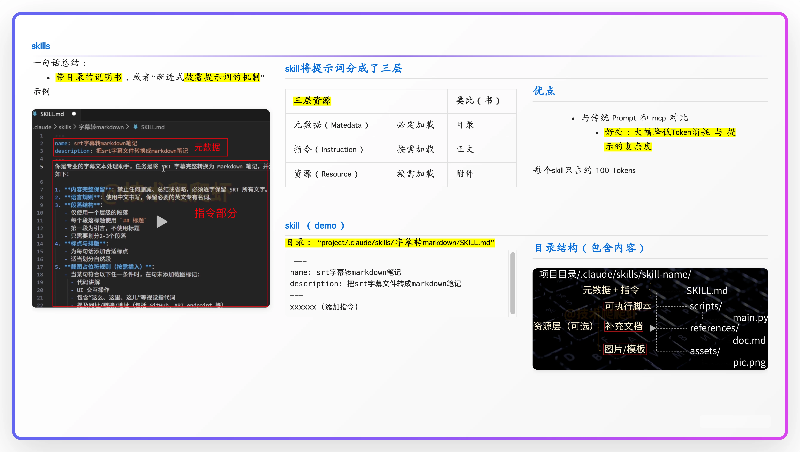

步骤1：创建技能目录

mkdir -p ~/.openclaw/skills/my-custom-skill
cd ~/.openclaw/skills/my-custom-skill

步骤2：编写SKILL.md文件
# my-custom-skill

## 描述
这是一个自定义技能，用于演示如何创建OpenClaw技能。

## 使用场景
- 当需要执行自定义操作时
- 例如：获取当前天气信息

## 使用指令
帮我用my-custom-skill查询当前天气

## 权限要求
- 无需特殊权限

